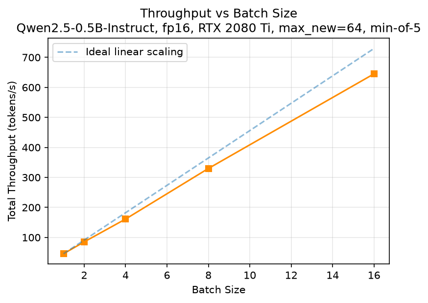
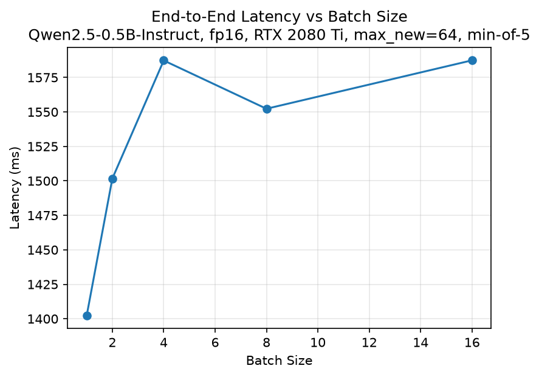
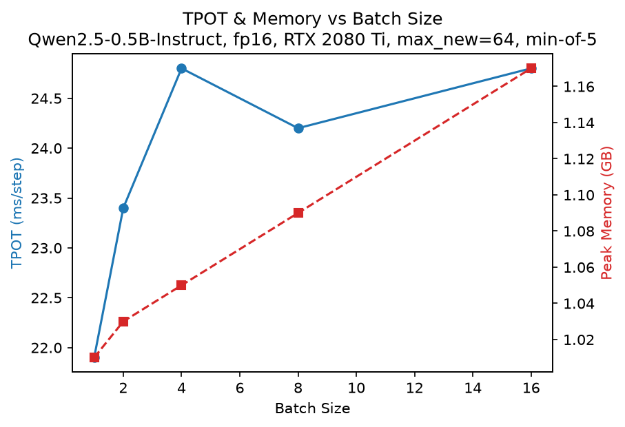

# LLM Inference Benchmark

Benchmarking Qwen2.5-0.5B-Instruct (fp16) on a single consumer GPU (RTX 2080 Ti), with a focus on how **latency, throughput, and memory scale with batch size** — and on *why* they scale the way they do.

**TL;DR**: batch-1 decoding is CPU-bound at only 45.6 tok/s because each `generate()` step costs ~22 ms of Python-side orchestration while the GPU needs just ~6 ms. Batching to 16 raises total throughput 14× to 645 tok/s with only +13% latency.

## Features

- Batch size sweep (1 → 16) on a single RTX 2080 Ti
- Metrics: end-to-end latency, TTFT (time to first token), TPOT (time per output token), total throughput, peak GPU memory
- Rigorous methodology: per-batch warmup, min-of-5, fixed generation length (`min_new_tokens`), explicit distinction between CPU submission time and GPU completion time
- Fully reproducible: one command reruns the sweep, figures regenerate from the CSV
- Week 2 GPU fundamentals (bandwidth, CUDA streams, DataLoader pipelining) included as groundwork experiments under `notes/` and `scripts/`

## Quick Start

```bash
# 1. Environment
conda create -n llm-bench python=3.12 -y && conda activate llm-bench
pip install torch==2.5.1 --index-url https://download.pytorch.org/whl/cu124
pip install -r requirements.txt        # transformers, accelerate, matplotlib

# 2. Model (~1 GB)
huggingface-cli download Qwen/Qwen2.5-0.5B-Instruct

# 3. Benchmark (writes results/w39/sweep_batch.csv)
python scripts/llm_bench_sweep.py

# 4. Figures (reads the CSV, writes figures/)
python scripts/plot_sweep.py
```

&gt; If HuggingFace is unreachable from your network, `export HF_ENDPOINT=https://hf-mirror.com` before step 2.

`requirements.txt`:

```
torch==2.5.1
transformers==4.55.4
accelerate&gt;=1.0
matplotlib&gt;=3.8
```

## Benchmark Results

### Setup

- Hardware: NVIDIA RTX 2080 Ti (11 GB), driver 615.71.09, idle machine
- Model: Qwen2.5-0.5B-Instruct, fp16 (~1 GB weights), stock HuggingFace `generate()`
- Workload: identical prompt replicated B times (homogeneous batch), forced generation length of 64 tokens (`min_new_tokens = max_new_tokens = 64`) so every run is directly comparable; EOS still terminates at step 65
- Methodology: 3 warmup runs per batch size (kernels are shape-dependent), then min-of-5 timed runs; TTFT measured separately via a synchronized single forward pass

### Results (2026-09-28 run)

| Batch | Latency (ms) | Total throughput (tok/s) | TPOT (ms/step) | Peak memory (GB) |
|---:|---:|---:|---:|---:|
| 1 | 1402.2 | 45.6 | 21.9 | 1.01 |
| 2 | 1501.7 | 85.2 | 23.4 | 1.03 |
| 4 | 1587.3 | 161.3 | 24.8 | 1.05 |
| 8 | 1552.3 | 329.8 | 24.2 | 1.09 |
| 16 | 1587.4 | 645.1 | 24.8 | 1.17 |





### Analysis

**Why is batch-1 decoding only 45.6 tok/s?** Because decoding is CPU-bound: each `generate()` step costs ~22 ms of Python-side orchestration (logit processing, sampling, cache management, kernel launches), while the GPU compute for one token of a 0.5B model takes only ~6 ms. Independent `nvidia-smi` sampling during decoding confirms this — GPU utilization stays around 30%, matching 6/22. The GPU spends most of each step idle, waiting for the next command.

**What does batching buy?** From B=1 to B=16, per-step GPU work grows ~16× while the Python overhead stays ~constant. End-to-end latency rises only 13% (1402 → 1587 ms) while total throughput grows 14.1× to 645 tok/s. Batch-invariant host overhead is amortized across requests — this measured trade-off is precisely the motivation for continuous batching in production serving systems.

**Why does TPOT rise slightly (21.9 → 24.8 ms)?** Step wall-time ≈ max(CPU time, GPU time). While CPU-bound, TPOT ≈ 22 ms regardless of batch size; as B grows, per-step GPU time approaches the CPU time and starts to show in the wall clock (+13% at B=16). The crossover into the GPU-bound regime lies beyond B=16.

**Why does throughput fall slightly below ideal scaling at B=16?** Same root cause: 645 tok/s vs. ideal 730 (88% efficiency) is the first visible cost of the GPU share rising inside the max().

**Why is memory nearly flat (1.01 → 1.17 GB)?** Memory = fixed weights (1 GB) + per-request KV cache/activations. The variable term is tiny at 64 output tokens for a 0.5B model, so 16× requests cost only +0.16 GB. Memory will not stay this flat for long-context or large-model workloads.

### Limitations & Outlook

All requests share an identical prompt, so padding is a no-op and the batch is homogeneous; real workloads with varying lengths behave differently. Generation length is fixed at 64 tokens, whereas production requests emit EOS early and unevenly. Measurements come from a shared machine (min-of-5 mitigates but does not eliminate noise). The stack is stock HuggingFace `generate()` with no CUDA graphs or serving optimizations.

This benchmark's central finding — a ~22 ms per-step host overhead dominating small-model decoding — is exactly the problem continuous batching and CUDA-graph-based engines (vLLM, TensorRT-LLM) are built to remove. Re-running this sweep under such an engine is the natural next step.

## Project Structure

```
.
├── figures/                     # result figures (regenerable)
├── logs/                        # raw experiment logs (gitignored)
├── notes/                       # daily experiment write-ups (Week 2 GPU fundamentals)
├── results/                     # CSV data tables (gitignored except committed CSVs)
├── scripts/
│   ├── llm_first_generate.py    # Task 1: first generation on GPU
│   ├── llm_bench.py             # batch=1 baseline harness
│   ├── llm_bench_sweep.py       # batch sweep 1→16
│   ├── plot_sweep.py            # figure generation from CSV
│   ├── exp_gpu_copy.py          # Week 2: copy bandwidth benchmark
│   ├── stream_overlap_benchmark.py  # Week 2: CUDA stream overlap
│   └── dl_bench.py              # Week 2: DataLoader study
├── requirements.txt
└── README.md
```

## References & Acknowledgments

- [Qwen2.5-0.5B-Instruct](https://huggingface.co/Qwen/Qwen2.5-0.5B-Instruct) — model under Apache 2.0
- [HuggingFace Transformers](https://github.com/huggingface/transformers) — `generate()`, tokenizer, streamer
- [PyTorch](https://pytorch.org/) — CUDA runtime
- Week 2 groundwork experiments in this repo (PCIe bandwidth, stream overlap, DataLoader pipelining) documented in `notes/`

## License

MIT